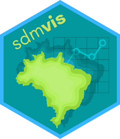

<!-- README.md is generated from README.Rmd. Please edit that file -->

```{r setup, include = FALSE}
knitr::opts_chunk$set(
  collapse = TRUE,
  comment = "#>",
  fig.path = "man/figures/README-",
  out.width = "100%"
)
```

# sdm**vis** 

<!-- badges: start -->
[](https://lifecycle.r-lib.org/articles/stages.html#experimental)
<!-- badges: end -->

**sdmvis** is a helper package: it enables to analyze SDM/ENM or any other spatial-based output in an interactive manner.

## Installation

Install the development version from GitHub with:

```{r, eval = FALSE}
# install.packages("devtools")
devtools::install_github("r-lib/usethis")
```

## Usage

For now, only the `sdm_leaflet` function is available. It enables to see SDM results through a _leaflet_ map with a single line of code.

## Next steps

More to come.
