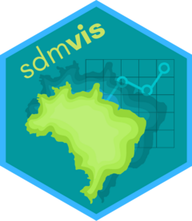

<!-- README.md is generated from README.Rmd. Please edit that file -->

# sdm**vis** 

<!-- badges: start -->

[](https://lifecycle.r-lib.org/articles/stages.html#experimental)
<!-- badges: end -->

**sdmvis** is a helper package: it enables to analyze SDM/ENM or any
other spatial-based output in an interactive manner.

## Installation

Install the development version from GitHub with:

``` r
# install.packages("devtools")
devtools::install_github("silasprincipe/sdmvis")
```

## Usage

For now, only the `sdm_leaflet` function is available. It enables to see
SDM results through a *leaflet* map with a single line of code.

## Next steps

More to come soon, including other visualization tools.
